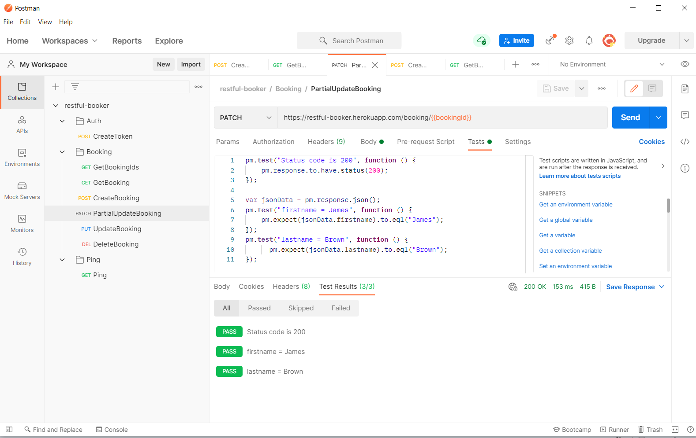
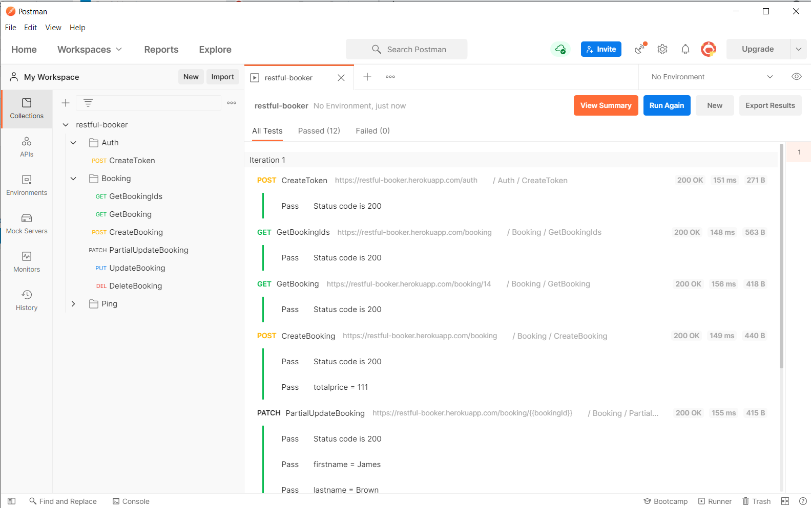
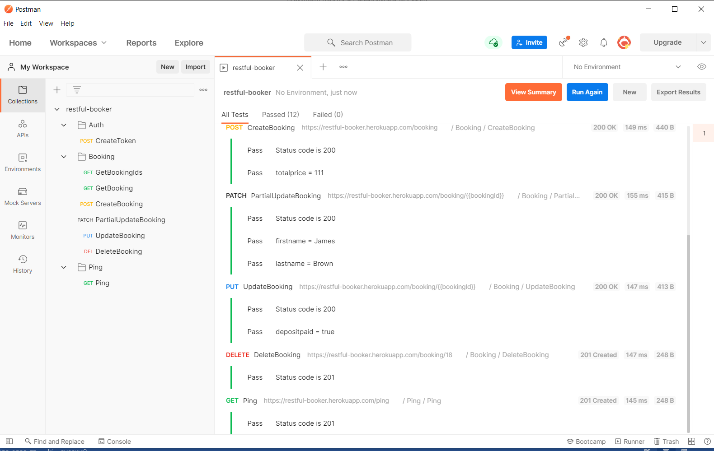

# API.
## API. SOAP API.
### Работа с API Яндекс.Спеллер.
*Написала тесты для метода checkTexts с проверкой  двух языков и кодов ошибок 1, 2 и 3.*

*Создала [XML-файл](resources/YandexSpeller-soapui-project-СеребряковаСМ.xml)
проекта SoapUI.*

# REST API.
## Написала запросы и тесты для API Restful-booker в POSTMAN. 
Тесты для следующих функций:
1. Auth — CreateToken;
1. Booking — GetBooking;
1. Booking — CreateBooking;
1. Booking — UpdateBooking
1. Booking — PartialUpdateBooking;
1. Booking — DeleteBooking;
1. Ping — HealthCheck.
У каждого теста проверки на статус ответа (200 ИЛИ 201 ИЛИ 404 и т. д.). Для Create, Update, PartialUpdate - и для данных в JSON.

*Все запросы и тесты в [файле](resources/restful-booker.postman_collection.json)*

*Скриншот результатов запуска Runner.*

