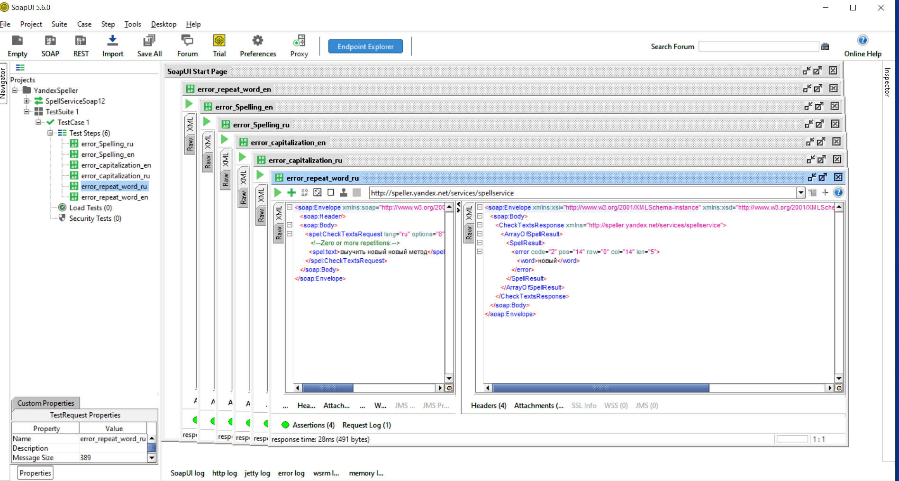

# SOAP API.
### Работа с API Яндекс.Спеллер.
*Написала тесты для метода checkTexts с проверкой  двух языков и кодов ошибок 1, 2 и 3.*

*Создала [XML-файл](resources/YandexSpeller-soapui-project-СеребряковаСМ.xml)
проекта SoapUI.*

### Автоматизирование тестирования сервиса калькулятора. 
*Выполнила 10 проверок на каждый эндпоинт и 2 интеграционных кейса*

*Создала [XML-файл](resources/Java-test-calculator-soapui-project.xml)
проекта SoapUI.*

